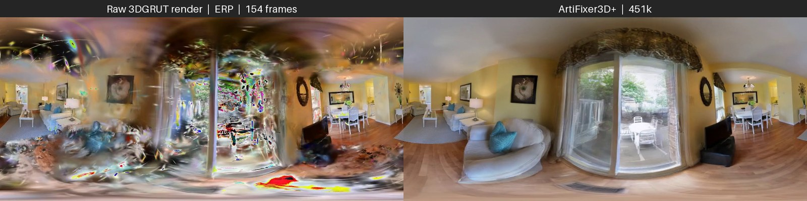
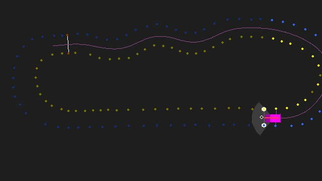
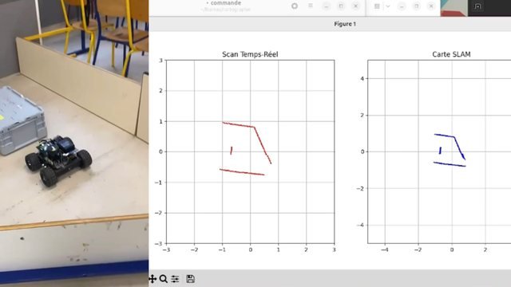
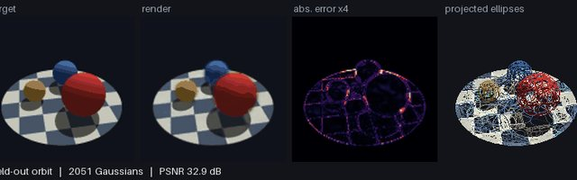
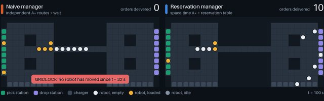
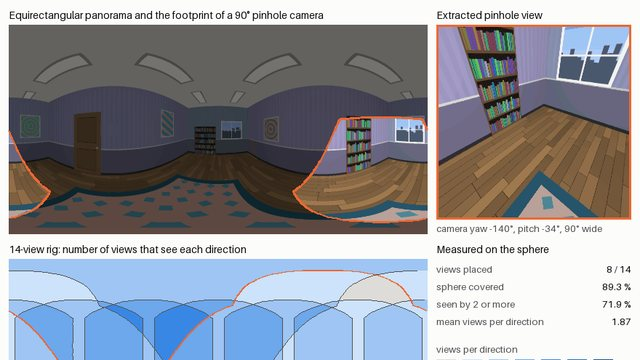
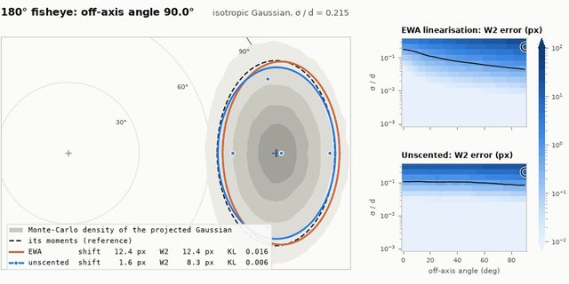

Final-year robotics engineering student at **UPSSITECH** (University of Toulouse, *Systèmes Robotiques et Interactifs*). I work on **3D Gaussian Splatting, 360° vision and robot navigation**, and spent spring and summer 2026 as a research intern at **AIST** in Tsukuba, Japan.

**Looking for a 6-month end-of-studies internship from March 2027** in robotics, 3D vision or autonomous navigation.

[Portfolio](https://guilhem0908.github.io) · [CV](https://guilhem0908.github.io/cv/) · [LinkedIn](https://www.linkedin.com/in/guilhem-carmouze/) · [Email](mailto:l7guilhem@gmail.com)

## Skills

<table>
<tr>
<td width="170" valign="middle"><b>3D vision</b></td>
<td width="620">

</td>
</tr>
<tr>
<td width="170" valign="middle"><b>Robotics &amp; navigation</b></td>
<td width="620">

</td>
</tr>
<tr>
<td width="170" valign="middle"><b>Machine learning</b></td>
<td width="620">

</td>
</tr>
<tr>
<td width="170" valign="middle"><b>Software &amp; tooling</b></td>
<td width="620">

 

</td>
</tr>
<tr>
<td width="170" valign="middle"><b>Spoken languages</b></td>
<td width="620">French (native) · English (professional) · Spanish (basic)</td>
</tr>
</table>

## How I work

- **Written communication.** Twelve dated [weekly notes](https://github.com/guilhem0908/artifixer-360-pipeline/tree/main/docs/weekly_progress) and a [handover guide](https://github.com/guilhem0908/artifixer-360-pipeline/blob/main/docs/HANDOVER.md), public in `artifixer-360-pipeline`.
- **Working in English.** Four months in a Japanese research lab, and a 29-page [internship report](https://github.com/guilhem0908/artifixer-360-pipeline/blob/main/docs/assets/readme/Rapport_de_stage_2026_CARMOUZE_Guilhem.pdf), all in English.
- **Rigour and honesty.** I wrote my own acceptance gates, then published [the run that failed them](https://github.com/guilhem0908/artifixer-360-pipeline/blob/main/docs/weekly_progress/2026-08-09.md) with its diagnosis.
- **Teamwork.** A team of six on the Fil Rouge robot, and the Formula Student driverless team. My repositories state my part and credit teammates by name.
- **Transparency about AI.** The report's appendix and my side-project READMEs both state where AI tools were used.

## Research internship at AIST, Japan (April to August 2026)

**Creation of a 360° navigation dataset using 3D Gaussian Splatting**, Computer Vision Research Team, Artificial Intelligence Research Center. [Read the case study](https://guilhem0908.github.io/work/aist-360-navigation/).

| Repository | What it does |
| :-- | :-- |
| **[artifixer-360-pipeline](https://github.com/guilhem0908/artifixer-360-pipeline)** | Plain pinhole video to repaired 360° video: a world-locked rig of 14 views, depth-aware multi-view diffusion consensus and geometry-locked distillation, built on NVIDIA ArtiFixer (+23,602 lines, 119 new tests). Temporal warp error 0.037 to 0.020 on the reference run; the full 154-frame run failed my own acceptance gates, and the repository documents why. |
| **[nav_3dgs_pano](https://github.com/guilhem0908/nav_3dgs_pano)** | Navigation and panoramic rendering inside a 3DGS scene (DISCOVERSE, MuJoCo): occupancy grid, A*, feathered cubemap-to-equirectangular stitching. |
| **[KachakaNavigation](https://github.com/guilhem0908/KachakaNavigation)** | ROS 2 Humble robot-side interface for a visual navigation model on the Kachaka robot: stale-frame checks, clamped velocity, dead-man timer. |

## Team projects

<table>
<tr>
<td width="50%" valign="top">

<b>TLSe Racing, Formula Student driverless</b> (2025 to 2026) 
I built the 2D simulator and tooling: sensor model, track loader, viewer. Teammates wrote the planners. 
<a href="https://github.com/guilhem0908/TLSe_Racing_Driverless">TLSe_Racing_Driverless</a> · <a href="https://github.com/guilhem0908/PathPlanning">PathPlanning</a>
</td>
<td width="50%" valign="top">

<b>Projet Fil Rouge</b> (2024 to 2025) 
A real mobile robot built by a team of six. My part: the web Bluetooth HMI, the camera stream and the ball-centring control. Before that, a colour-ball detector in pure C, written with Alec Bossard. 
<a href="https://github.com/guilhem0908/PFR2">PFR2</a> (team repository) · <a href="https://github.com/guilhem0908/PFR">PFR</a>
</td>
</tr>
</table>

**Usine 4.0** (Industry 4.0 smart factory): final-year team project, in progress (2026 to 2027).

## Side projects

Personal studies from October 2026 that extend themes of my internship and team work. They were built with AI assistance, and every number in their READMEs is reproduced by a script in the repository.

<table>
<tr>
<td width="50%" valign="top">

<b><a href="https://github.com/guilhem0908/microsplat">microsplat</a></b> 
3D Gaussian Splatting from scratch: a NumPy reference rasteriser, a differentiable PyTorch twin, and tests that pin every equation. 33.6 dB PSNR on held-out views of a ray-traced scene.
</td>
<td width="50%" valign="top">

<b><a href="https://github.com/guilhem0908/amr-traffic-lab">amr-traffic-lab</a></b> 
Usine 4.0 intralogistics: how many mobile robots can an aisle take before it jams? The reservation-based traffic manager never gridlocked in 600 simulated one-hour runs.
</td>
</tr>
<tr>
<td width="50%" valign="top">

<b><a href="https://github.com/guilhem0908/erpkit">erpkit</a></b> 
A tested geometry toolkit for 360° images. It measures what stitching costs: six 1024 px faces at 96° sample the sphere 1.41 times more coarsely than a 4096×2048 panorama.
</td>
<td width="50%" valign="top">

<b><a href="https://github.com/guilhem0908/gaussian-projection-bench">gaussian-projection-bench</a></b> 
How wrong is the splat? EWA linearisation against the unscented transform through pinhole, fisheye and equirectangular cameras, measured against a Monte-Carlo reference.
</td>
</tr>
</table>

Four more, each with one measured result:

- **[splat-navmap](https://github.com/guilhem0908/splat-navmap)**: at an opacity threshold of 0.5, 28.8% of A* paths on a grid sliced from a synthetic splat scene enter real geometry with centre counting, 1.6% with footprint accumulation.
- **[cone-ekf-slam](https://github.com/guilhem0908/cone-ekf-slam)**: EKF-SLAM on simulated Formula Student cone tracks; nearest-neighbour association picks a wrong cone in 17 of 50 runs at 4 m of sensor range, in 1 of 50 at 15 m.
- **[usine40-cell-pipeline](https://github.com/guilhem0908/usine40-cell-pipeline)**: a simulated Usine 4.0 cell through OPC UA, MQTT, PostgreSQL and Grafana; the stored OEE matches the simulator's event log in every window compared, largest error 0.000 pp.
- **[visual-quality-gate](https://github.com/guilhem0908/visual-quality-gate)**: PaDiM and PatchCore as a quality gate; a threshold aimed at 5% false rejects refused 10.5% of good parts and let 6.3% of defective ones through.
